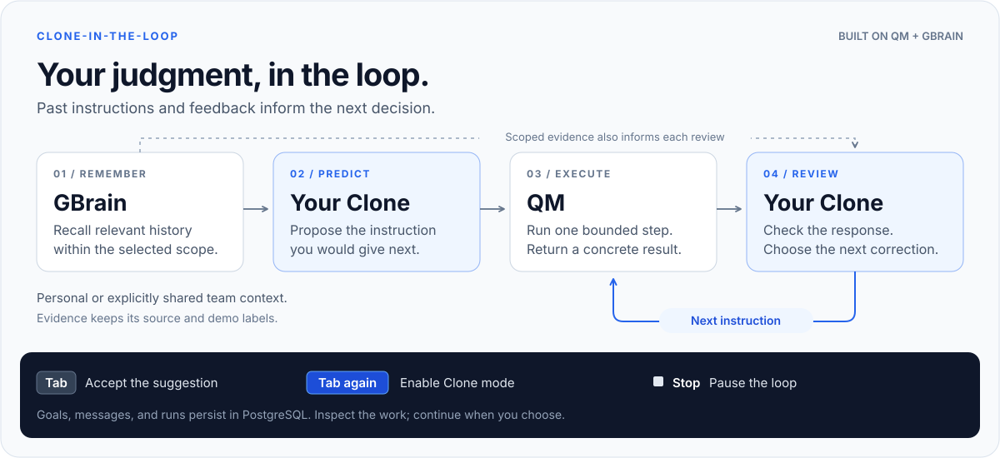
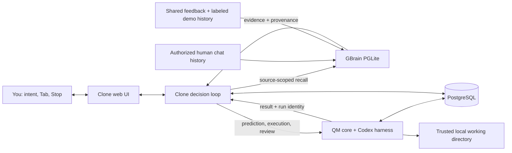

# Clone-in-the-Loop

**Your agent does the work. Your Clone decides what comes next.**

Agents can write code, draft a launch post, and research a market. You still have to decide what needs to change, spot what is missing, and write the next instruction.

Clone-in-the-Loop helps you delegate those decisions to a **Clone that draws on your past instructions and feedback**. Built as an extension of [QM](https://github.com/yc-software/qm), it uses [GBrain](https://github.com/garrytan/gbrain) to retrieve relevant personal or shared team history. Your Clone uses that context to suggest the next prompt, review QM's response, and ask for a correction.

**QM executes. GBrain remembers. Your Clone keeps your judgment in the loop.**

**[Watch the demo](https://www.loom.com/share/f989c778d4f14d05acfe0a20d9bdfbc3)** · [Run locally](#quickstart) · [Explore the implementation](#what-we-added-to-qm) · [Upstream QM PR](https://github.com/yc-software/qm/pull/1671)



Press **Tab** to accept a suggestion and read it before sending. Press **Tab again** to enable Clone mode and let the cycle continue. Press **Stop** whenever you want to pause it.

We are building for AI-native founders who work across **Research, Product, and Marketing**, delegating to both agents and people. The aim is to make their judgment useful across recurring work without requiring them to write every follow-up.

## Why this fits Own Your Intelligence

To us, **owning your intelligence** means putting your past judgment to work: the instructions you give, the details you catch, and the standards you apply when reviewing a result.

The [hackathon](https://events.ycombinator.com/gstack-qm-river-memorable-hackathon) invites builders to extend QM and GBrain, create new agent workflows and interfaces, and explore multiplayer and software-factory ideas. Clone brings those themes together in a working prototype:

| Event theme                            | How we put it to work                                                                                                                                                                                                                                                                           |
| -------------------------------------- | ----------------------------------------------------------------------------------------------------------------------------------------------------------------------------------------------------------------------------------------------------------------------------------------------- |
| **Extend QM and GBrain**               | QM runs the model turns and tools, while the official GBrain engine retrieves history for prediction and review. Clone connects them so that past feedback can guide the next instruction. [Explore the integration.](#what-we-added-to-qm)                                                     |
| **A new agent workflow and interface** | A suggestion leads to execution, review, and a follow-up instruction. With **Tab → Tab → Stop**, you can accept a suggestion, delegate the cycle, and take control back. [Try the loop.](#try-the-complete-loop)                                                                                |
| **Multiplayer ideas**                  | A teammate's shared feedback can guide a review without exposing personal history to team retrieval. The prototype demonstrates this with one local operator and a clearly labeled fictional teammate. [Read about the boundaries.](#memory-and-team-boundaries)                                |
| **Software-factory ideas**             | The same loop supports recurring **Research, Product, and Marketing** work. Goals keeps saved work and progress visible, while Inbox suggests what to work on next. The launch-review workflow produces a reusable template. [See an example.](#a-launch-review-from-instruction-to-correction) |

## What makes Clone different

**We focus on the person directing the agents.** The question behind each prediction is: _What would this person ask the agent to do next?_

- **Your history shapes the next prompt.** GBrain retrieves relevant instructions and feedback from your past conversations. Your Clone uses them to suggest what you would ask next, and you can inspect the sources behind the suggestion.
- **Review leads to another action.** Your Clone compares the response with the Goal and your past feedback, identifies what needs attention, and sends QM a specific follow-up instruction.
- **You choose when to delegate.** The first Tab accepts a suggestion for you to inspect. A second Tab enables Clone mode, and Stop pauses it. The saved conversation keeps the instructions, results, and reviews available for you to revisit.
- **Shared context can guide a teammate's Clone.** Selecting a teammate brings shared history into prediction and review. The aim is to apply a team's standards across recurring work; the current demo explores that interaction using clearly labeled fictional history.

Together, these features let us explore how much of the follow-up work a Clone can take on. The prototype personalizes its predictions and reviews through retrieved history. The [verification record](docs/verification.md) shows what it executed and what changed, while prediction quality and time savings remain to be measured.

## A launch review, from instruction to correction

In the recorded launch-review workflow, the Clone asked QM to supply missing deliverables and tighten the copy. QM revised the artifact, and a separate inspection of the saved template confirmed a **50-word post, one call to action, and an explicit publication checklist**. Pressing Stop left the Goal paused.

| Watch for                  | What to inspect                                                                                                                          |
| -------------------------- | ---------------------------------------------------------------------------------------------------------------------------------------- |
| **Prediction**             | A partial request prompts a suggested instruction, which you can accept with Tab before execution.                                       |
| **Delegation**             | A second Tab starts Clone mode. The conversation labels Clone instructions, QM results, and reviews separately.                          |
| **Correction**             | The review identifies a specific gap and turns it into a follow-up instruction. Compare the results to see what changed.                 |
| **Team context**           | Clone Garry draws on clearly labeled fictional shared history. The demo does not represent a real person's participation or endorsement. |
| **Control and continuity** | Stop pauses the loop. The Goals board keeps saved work visible in Ready, In progress, and Paused columns.                                |

The [verification record](docs/verification.md) explains how we checked the saved artifact, confirmed the paused state, and tested whether history survived a restart. It also records video playback checks separately. These observations show how the prototype behaved; they do not measure time saved or prediction quality.

## What we added to QM

- **Next-prompt prediction** uses GBrain evidence to suggest an instruction inline. Tab accepts it, and a second Tab activates Clone mode. Revision tracking associates each suggestion with the draft that produced it.
- **Clone mode** repeats the instruction → execution → review → improvement cycle, saves its messages, and lets you interrupt it.
- **Personal and team workspaces** determine which memory sources are available to a prediction or review.
- **Teammate Clones** use shared context to bring a teammate's review perspective into the workflow. Clone Garry is a fictional demo persona inspired by Garry Tan, with invented history.
- **Goals and Inbox** bring saved work and suggested next sessions into one web interface.
- **Inspectable memory** shows the source labels, excerpts, and demo markers behind predictions and reviews.

This repository is a **QM source fork** that preserves the upstream history and MIT license. Most of the extension lives in `plugins/clone-ui`, alongside a small runtime addition for trusted local execution. QM runs the work, and the official GBrain engine retrieves the history used by Clone.

| Layer      | Responsibility                                                                            | Start reading                                                                                                                    |
| ---------- | ----------------------------------------------------------------------------------------- | -------------------------------------------------------------------------------------------------------------------------------- |
| **Clone**  | Interaction, prompt prediction, review, next instruction, and loop control.               | [`loop.ts`](plugins/clone-ui/server/loop.ts), [`prompts.ts`](plugins/clone-ui/server/prompts.ts), [`src/`](plugins/clone-ui/src) |
| **QM**     | Authenticated internal API, model turns, tools, run lifecycle, and execution persistence. | [`qm.ts`](plugins/clone-ui/server/qm.ts), [`src/`](src)                                                                          |
| **GBrain** | Local history storage, source-scoped recall, and inspectable evidence.                    | [`memory/`](plugins/clone-ui/server/memory)                                                                                      |

Following [QM's contribution policy](https://github.com/yc-software/qm/blob/main/CONTRIBUTING.md), the [upstream QM PR](https://github.com/yc-software/qm/pull/1671) contains a short feature proposal. **The runnable implementation is on this fork's `main` branch.** The proposal is open and has not been accepted upstream.

## How it works



**QM** handles model turns, tools, cancellation, and PostgreSQL persistence through its authenticated internal API and Codex harness. Prediction and review each run as a separate read-only model turn. An execution turn performs one bounded step, then returns its result to the Clone for review.

**GBrain** stores and indexes imported history using its official PGLite engine. You can import your own messages from local Codex and Claude histories. Retrieval uses keyword search within the selected sources, including GBrain's CJK handling and OR fallback, so no embedding API key is required. This build does not use hosted GBrain federation or semantic vector search.

The [architecture guide](docs/architecture-clone.md) explains how the components interact, how state is saved, and what happens when an operation fails.

## Quickstart

### Prerequisites

- Node.js **24.15+** and npm **11.10+**.
- Bun **1.3.10+** on `PATH`, or `CLONE_BUN` set to its executable.
- PostgreSQL **16+** with its contrib extensions. `initdb` and `pg_ctl` must be on `PATH`, or set `CLONE_PG_BIN` to the PostgreSQL bin directory.
- A working Codex login and access to the configured model. Model calls use your account.

### Install

```sh
git clone https://github.com/cloneismin/clone-in-the-loop.git
cd clone-in-the-loop
npm ci
npm run clone:setup
npx codex login
```

Setup installs the web plugin and the pinned revision of official GBrain. Importing personal history is a separate, optional step.

This prototype runs locally with **your permissions and model account**. Keep it bound to loopback, and read [Memory and team boundaries](#memory-and-team-boundaries) before importing history or running a Goal.

### Add personal memory, optionally

To use your recent instructions and feedback as context, import your history before starting the web application:

```sh
npm run clone:import
```

The importer reads a limited set of recent user messages from your local Codex and Claude histories. It excludes assistant messages, tool results, injected environment records, and recognizable credentials. Imported history is stored locally in a Git-ignored directory. Relevant excerpts are sent to your configured model when it predicts an instruction or reviews a result. You can also use Clone without importing history, although it will have less context for personalization.

Only one process can own the GBrain database at a time. Stop `clone:dev` or `clone:start` before running another import, then restart the application afterward.

### Start the application

Terminal 1 starts the local PostgreSQL cluster and QM core:

```sh
npm run clone:core
```

Terminal 2 starts the Clone API and Vite development server:

```sh
npm run clone:dev
```

Open **[http://127.0.0.1:4317](http://127.0.0.1:4317)**. The Clone API runs on port `4318`, QM on `8088`, and the local PostgreSQL cluster on `55432`.

For a built web application, keep QM running and replace the development server with:

```sh
npm run clone:build
npm run clone:start
```

Then open **[http://127.0.0.1:4318](http://127.0.0.1:4318)**.

### Try the complete loop

1. Select the Personal workspace and open **New**. Start a request such as `Create a weekly launch review template`. If you imported history, inspect the memory evidence shown with the prediction.
2. Press **Tab** to accept the suggestion. Read it, then press **Tab** again without editing it to enable Clone mode.
3. Follow one QM result through the Clone's review and the next correction. Open any generated artifact to check what actually changed.
4. Press **Stop**, then open **Goals** and reopen the paused conversation. Its messages and progress should remain available.
5. Switch to the team workspace and select **Clone Garry**. Try a launch-review request and inspect the labels identifying fictional shared history. Team retrieval excludes your personal imports.

You can explore the interface and fictional teammate without importing personal history. Prediction and execution require working Codex access. Clone mode continues after an individual step is complete, so press **Stop** when you are finished.

### Navigate and compose

| Destination | macOS          | Windows / Linux |
| ----------- | -------------- | --------------- |
| New         | `Cmd+Option+1` | `Ctrl+Alt+1`    |
| Inbox       | `Cmd+Option+2` | `Ctrl+Alt+2`    |
| Goals       | `Cmd+Option+3` | `Ctrl+Alt+3`    |
| Memories    | `Cmd+Option+4` | `Ctrl+Alt+4`    |

**New** opens a blank composer in the selected project, and **Goals** shows saved conversations and their progress. To start Clone mode, accept a suggestion with **Tab**, then press **Tab again** without editing the instruction. You can also use the **Clone** switch in the composer. Its border glows blue while Clone mode is on. Turn the switch off or press the square **Stop** control to pause the loop.

Press **Enter** to send a message, **Shift+Enter** to add a line, or **Esc** to dismiss a suggestion. The profile button opens the shortcut reference.

### Configuration

| Variable          | Purpose                                                                              |
| ----------------- | ------------------------------------------------------------------------------------ |
| `CODEX_MODEL`     | QM's Codex model; defaults to `gpt-6-sol`. Choose a model available to your account. |
| `CLONE_BUN`       | Bun executable when it is outside `PATH`.                                            |
| `CLONE_PG_BIN`    | Directory containing PostgreSQL executables.                                         |
| `CLONE_CORE_PORT` | QM port; defaults to `8088`.                                                         |
| `CLONE_PG_PORT`   | Managed PostgreSQL port; defaults to `55432`.                                        |
| `DATABASE_URL`    | Use an existing PostgreSQL database instead of creating the local cluster.           |

Runtime settings, signing material, PostgreSQL data, and local working directories are stored under `data/clone-runtime/`. GBrain and its private memory database are stored under `.clone-loop/`. Both directories are ignored by Git and should remain untracked.

## Memory and team boundaries

| Selected context         | Available evidence                                                    |
| ------------------------ | --------------------------------------------------------------------- |
| **Min Kim / Personal**   | Min's imported human messages and private feedback.                   |
| **Min Kim / Team**       | Explicitly shared team feedback and labeled demo records.             |
| **Garry Tan / Team**     | The same team-shared scope, including Garry's synthetic demo history. |
| **Garry Tan / Personal** | Rejected. Garry cannot select Min's private source.                   |

Switching to Team does not share your imported personal history. Messages you send in a team session become shared feedback for that workspace. Clone Garry is a fictional demo teammate with invented history, and the evidence shown in the app retains those demo labels.

This build is designed for **one trusted local operator**. It does not provide production user authentication, authorization between users, or OS sandbox isolation. Commands run with the operator's local permissions. Memory source filtering is implemented and tested, but a production team deployment would need additional access controls. Keep this demo bound to loopback.

## Verification

Run the extension checks:

```sh
npm run clone:typecheck
npm run clone:test
npm run clone:build
```

With QM running, exercise a real Codex turn through the core:

```sh
npm run clone:core:smoke
```

The following results were recorded for the September 27 prototype:

| Layer                             | Evidence                                                                                                                                                                                                                                                                                    |
| --------------------------------- | ------------------------------------------------------------------------------------------------------------------------------------------------------------------------------------------------------------------------------------------------------------------------------------------- |
| Automated checks                  | [Clone CI](https://github.com/cloneismin/clone-in-the-loop/actions/runs/36360115469) passed 93 tests at `6c7623f`. Additional local checks covered Codex cancellation, documentation contracts, and navigation shortcuts.                                                                   |
| TypeScript, lint, and build       | Typechecks for the core and extension passed, along with extension ESLint and the production web build.                                                                                                                                                                                     |
| Real execution                    | QM produced a Research response with sources and a Product command-line tool. The tool's three unit tests passed independently, and running it with CSV input produced output.                                                                                                              |
| Clone mode and Stop               | Browser checks observed six personal iterations and seven fictional-teammate iterations before the Garry persona update. Stop saved a paused state with no further continuation, and personal work survived a restart.                                                                      |
| Prediction and workspace behavior | Browser checks confirmed GBrain-backed predictions and Tab acceptance. Separate delayed-response checks covered workspace navigation and draft preservation. Long-text layout was checked with a synthetic browser fixture.                                                                 |
| Demo                              | A recorded Goal reached twelve iterations, revised a 50-word draft and its approval checklist, and remained paused after Stop. The 93-second cut included the Goals board and upstream proposal. Its complete public Loom playback at 2560 × 1440 is documented in the verification record. |

The [verification record](docs/verification.md) distinguishes automated checks from observed browser behavior and work still awaiting review. The Clone reviews model responses, so it cannot guarantee that every generated artifact is correct. Open and check any result before relying on it for a consequential action.

## Repository guide

| Path                                                               | Responsibility                                                                           |
| ------------------------------------------------------------------ | ---------------------------------------------------------------------------------------- |
| [`plugins/clone-ui/src`](plugins/clone-ui/src)                     | Lit interface, composer, Goals, Inbox, workspaces, and memory views.                     |
| [`plugins/clone-ui/server`](plugins/clone-ui/server)               | Goal API, PostgreSQL store, QM client, prediction prompts, and loop control.             |
| [`plugins/clone-ui/server/memory`](plugins/clone-ui/server/memory) | Official GBrain setup, bounded history import, scoped retrieval, and synthetic fixtures. |
| [`scripts/clone-runtime`](scripts/clone-runtime)                   | Reproducible trusted-local QM startup and smoke check.                                   |
| [`src`](src)                                                       | Upstream QM core, with narrowly scoped runtime extensions.                               |
| [`docs/architecture-clone.md`](docs/architecture-clone.md)         | Design decisions, data flow, persistence, and known limitations.                         |
| [`docs/pitch.md`](docs/pitch.md)                                   | 30-second and 60-second presentation scripts.                                            |
| [`demo/README.md`](demo/README.md)                                 | Storyboard, recording provenance, and production instructions for the demo.              |
| [`docs/feedback-audit.md`](docs/feedback-audit.md)                 | Product feedback and its implementation or verification status.                          |
| [`README.qm.md`](README.qm.md)                                     | Preserved upstream QM documentation.                                                     |

## Credits and license

We built Clone-in-the-Loop for the **Own Your Intelligence Hackathon** by extending [QM by YC Software](https://github.com/yc-software/qm) and integrating [GBrain by Garry Tan](https://github.com/garrytan/gbrain). Both projects use the MIT license. This fork preserves QM's history and attribution; see [LICENSE](LICENSE).
