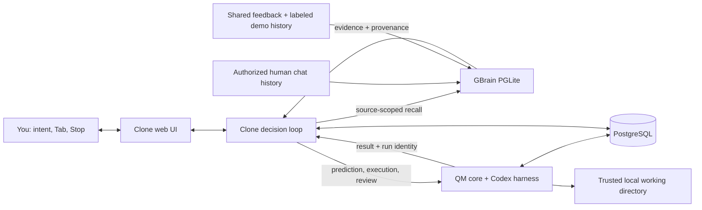

# Clone-in-the-Loop

**Your agent does the work. Your Clone decides what comes next.**

An AI-native founder should not have to write every follow-up, catch every missing detail, and keep restarting the same workflow. Clone-in-the-Loop extends [QM](https://github.com/yc-software/qm) with a personal decision loop, grounded in conversation history stored in [GBrain](https://github.com/garrytan/gbrain).

Start with a Goal. Your Clone predicts the next instruction. Press **Tab** to accept it, or enable **Clone mode** to let it execute, review, and improve the work until you press **Stop**. Switch to a team workspace to explore a teammate's shared judgment, with every synthetic demo record labeled.

[Quickstart](#quickstart) · [How it works](#how-it-works) · [Architecture](docs/architecture-clone.md) · [Demo script](docs/pitch.md) · [Build plan](docs/clone-in-the-loop-plan.md) · [Upstream QM](README.qm.md)

## See the loop

| Step         | What happens                                                                                        |
| ------------ | --------------------------------------------------------------------------------------------------- |
| **Remember** | GBrain retrieves relevant, source-scoped evidence from human chat history.                          |
| **Predict**  | A Clone proposes the next instruction using the Goal, conversation, and retrieved evidence.         |
| **Execute**  | QM runs the instruction through its Codex harness and records the execution.                        |
| **Review**   | The Clone examines the result against the Goal and remembered preferences.                          |
| **Improve**  | It requests a correction or chooses the next useful improvement. Stop remains available throughout. |

**Demo video:** recording and Loom upload pending. A verified playback link will be added here. The [90-second storyboard and production kit](demo/README.md) describe the fresh capture and review process.

**Product screenshots:** browser acceptance and review captures pending.

## What we added to QM

- **Next-prompt prediction.** Inline suggestions grounded in GBrain evidence, with Tab acceptance and draft-revision tracking.
- **Continuous Clone mode.** A visible instruction → execution → review → improvement loop, with durable messages and explicit interruption.
- **Personal and team workspaces.** The active workspace determines which memory sources enter a prediction.
- **Teammate Clones.** Clone Jun demonstrates a teammate's review style using clearly labeled synthetic, shared history.
- **Goals and Inbox.** Persisted work and model-proposed next Goals in one web interface.
- **Inspectable memory.** Source labels, excerpts, and demo markers travel with the predictions and reviews they inform.

This repository is a **QM source fork**, preserving its upstream history and MIT license. The extension lives primarily in `plugins/clone-ui`, with a small runtime addition for explicitly trusted local execution. QM remains the execution foundation; GBrain is part of the actual retrieval path.

## How it works



**QM** supplies the authenticated internal core-client boundary, turn and run APIs, Codex harness, execution lifecycle, and PostgreSQL persistence. Predictions and reviews are separate read-only model turns. Execution turns perform one bounded step, then return to the Clone for review.

**GBrain** supplies its official PGLite engine, schema, page and chunk storage, indexing, and source-aware keyword retrieval. Personal Codex and Claude user messages can be imported locally. The default is keyword retrieval, including GBrain's CJK handling and OR fallback; no embedding API key is required. This submission does not claim hosted GBrain federation or semantic vector retrieval.

The [architecture guide](docs/architecture-clone.md) documents the boundaries, state transitions, and failure behavior.

## Quickstart

### Prerequisites

- Node.js **24.15+** and npm **11+**.
- Bun **1.3.10+** on `PATH`, or `CLONE_BUN` set to its executable.
- PostgreSQL **16+** with its contrib extensions. `initdb` and `pg_ctl` must be on `PATH`, or set `CLONE_PG_BIN` to the PostgreSQL bin directory.
- A working Codex login and access to the configured model. Model calls use your account.

### Install

```sh
git clone https://github.com/cloneismin/clone-in-the-loop.git
cd clone-in-the-loop
npm ci
npm run clone:setup
npx codex login
```

Setup installs the web plugin and the official GBrain revision pinned by this project. It does not import your history automatically.

### Add personal memory, optionally

Before starting the web application, explicitly import your recent human chat history:

```sh
npm run clone:import
```

The importer reads bounded recent user messages from your local Codex and Claude histories. It excludes assistant/tool messages, injected environment records, and recognizable credentials. Personal history remains in ignored local data. An empty personal corpus also works, with less evidence for personalized predictions.

GBrain uses a single database owner. Stop `clone:dev` or `clone:start` before running another import; start the application again afterward.

### Start the application

Terminal 1 starts the local PostgreSQL cluster and QM core:

```sh
npm run clone:core
```

Terminal 2 starts the Clone API and Vite development server:

```sh
npm run clone:dev
```

Open **[http://127.0.0.1:4317](http://127.0.0.1:4317)**. The Clone API runs on port `4318`, QM on `8088`, and the local PostgreSQL cluster on `55432`.

For a built web application, keep QM running and replace the development server with:

```sh
npm run clone:build
npm run clone:start
```

Then open **[http://127.0.0.1:4318](http://127.0.0.1:4318)**.

### Configuration

| Variable          | Purpose                                                                              |
| ----------------- | ------------------------------------------------------------------------------------ |
| `CODEX_MODEL`     | QM's Codex model; defaults to `gpt-6-sol`. Choose a model available to your account. |
| `CLONE_BUN`       | Bun executable when it is outside `PATH`.                                            |
| `CLONE_PG_BIN`    | Directory containing PostgreSQL executables.                                         |
| `CLONE_CORE_PORT` | QM port; defaults to `8088`.                                                         |
| `CLONE_PG_PORT`   | Managed PostgreSQL port; defaults to `55432`.                                        |
| `DATABASE_URL`    | Use an existing PostgreSQL database instead of creating the local cluster.           |

Runtime configuration, signing material, PostgreSQL data, and local working directories live under ignored `data/clone-runtime/`. GBrain and its private memory database live under ignored `.clone-loop/`. Do not commit either directory.

## Memory and team boundaries

| Selected context   | Available evidence                                                  |
| ------------------ | ------------------------------------------------------------------- |
| **Min / Personal** | Min's imported human messages and private feedback.                 |
| **Min / Team**     | Explicitly shared team feedback and labeled demo records.           |
| **Jun / Team**     | The same team-shared scope, including Jun's synthetic demo history. |
| **Jun / Personal** | Rejected. Jun cannot select Min's private source.                   |

Switching to Team does not share imported personal history. A human message sent in a team Goal becomes shared feedback for that workspace. The teammate persona is synthetic; this is not a claim of a real teammate's participation.

This build is for **one trusted local operator**. It has no production user authentication, multi-user authorization, or OS sandbox isolation. The trusted-host runtime can execute commands with the operator's local permissions. Memory source filtering is real and tested, but it is not a replacement for a production identity boundary. Keep this demo on loopback.

## Verification

Run the extension checks:

```sh
npm run clone:typecheck
npm run clone:test
npm run clone:build
```

With QM running, exercise a real Codex turn through the core:

```sh
npm run clone:core:smoke
```

Current verification status:

| Layer                                                        | Evidence                                                                                                  |
| ------------------------------------------------------------ | --------------------------------------------------------------------------------------------------------- |
| QM runtime changes                                           | 61 targeted runtime tests passed during implementation.                                                   |
| GBrain adapter                                               | 4 tests passed, including real PGLite retrieval, private/team isolation, and persistence after reopening. |
| Memory code quality                                          | Strict TypeScript and ESLint checks passed.                                                               |
| Frontend build and browser acceptance                        | Pending final integration verification.                                                                   |
| Continuous loop, Stop, and workspace behavior in the browser | Pending end-to-end acceptance.                                                                            |
| Final demo and Loom playback                                 | Pending recording and upload.                                                                             |

A passing unit test is not treated as proof of the complete product interaction. The final acceptance checklist is in the [build plan](docs/clone-in-the-loop-plan.md).

## Repository guide

| Path                                                               | Responsibility                                                                           |
| ------------------------------------------------------------------ | ---------------------------------------------------------------------------------------- |
| [`plugins/clone-ui/src`](plugins/clone-ui/src)                     | Lit interface, composer, Goals, Inbox, workspaces, and memory views.                     |
| [`plugins/clone-ui/server`](plugins/clone-ui/server)               | Goal API, PostgreSQL store, QM client, prediction prompts, and loop control.             |
| [`plugins/clone-ui/server/memory`](plugins/clone-ui/server/memory) | Official GBrain setup, bounded history import, scoped retrieval, and synthetic fixtures. |
| [`scripts/clone-runtime`](scripts/clone-runtime)                   | Reproducible trusted-local QM startup and smoke check.                                   |
| [`src`](src)                                                       | Upstream QM core, with narrowly scoped runtime extensions.                               |
| [`docs/architecture-clone.md`](docs/architecture-clone.md)         | Design decisions, data flow, persistence, and known limitations.                         |
| [`docs/pitch.md`](docs/pitch.md)                                   | 30-second and 60-second presentation scripts.                                            |
| [`README.qm.md`](README.qm.md)                                     | Preserved upstream QM documentation.                                                     |

## Credits and license

Built for the QM and GBrain hackathon, extending [QM by YC Software](https://github.com/yc-software/qm) and integrating [GBrain by Garry Tan](https://github.com/garrytan/gbrain). Both projects are MIT licensed. Upstream history and attribution are preserved. See [LICENSE](LICENSE).
