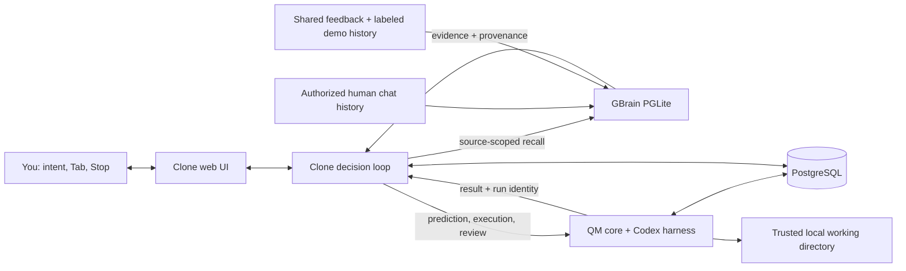

# Clone-in-the-Loop

**Your agent does the work. Your Clone decides what comes next.**

Agents can write the code, draft the launch, and research the market. You still supply the next decision: what to change, what is missing, and what to do next.

Clone-in-the-Loop gives that job to a **Clone of your judgment**, grounded in your past instructions and feedback. It extends [QM](https://github.com/yc-software/qm) with next-prompt prediction and a continuous execution-and-review loop, using [GBrain](https://github.com/garrytan/gbrain) to recall relevant personal or shared team history.

**QM executes. GBrain remembers. Your Clone keeps your judgment in the loop.**

**[Watch the 93-second demo](https://www.loom.com/share/f989c778d4f14d05acfe0a20d9bdfbc3)** · [Run locally](#quickstart) · [Inspect the implementation](#what-we-added-to-qm) · [QM proposal](https://github.com/yc-software/qm/pull/1671)


**Tab once:** accept the predicted instruction. **Tab again:** enable Clone mode. **Stop:** pause the loop. You can inspect the instruction before handing over the next step.

Built for AI-native founders who work across **Research, Product, and Marketing** and delegate to both agents and people. The ambition is a company whose repeated work carries its people's judgment forward.

## Why this fits Own Your Intelligence

Our interpretation of **owning your intelligence** is making your past judgment useful in the next piece of work: the instructions you give, the details you catch, and the standards you bring to a review.

The [hackathon](https://events.ycombinator.com/gstack-qm-river-memorable-hackathon) invites builders to extend QM and GBrain, create new agent workflows and interfaces, and explore multiplayer and software-factory ideas. We connect those themes in one working loop:

| Event theme                            | How we put it to work                                                                                                                                                                                                                                                              |
| -------------------------------------- | ---------------------------------------------------------------------------------------------------------------------------------------------------------------------------------------------------------------------------------------------------------------------------------- |
| **Extend QM and GBrain**               | QM's real model turns, tools, and persistence power execution. Official GBrain supplies scoped history to prediction and review. The contribution is the decision loop connecting them. [Inspect the integration.](#what-we-added-to-qm)                                           |
| **A new agent workflow and interface** | A predicted instruction becomes a concrete result, a review, and the next correction. **Tab → Tab → Stop** lets the user move from accepting a suggestion to delegating the loop and taking control back. [Try it.](#try-the-complete-loop)                                        |
| **Multiplayer ideas**                  | A teammate's shared review context can guide the next step. Personal and team sources stay separate. One local owner and a labeled fictional teammate make this interaction inspectable in the prototype. [See the boundaries.](#memory-and-team-boundaries)                       |
| **Software-factory ideas**             | The same loop supports repeated work across **Research, Product, and Marketing**. Goals shows saved work and progress; Inbox proposes next work. The launch-review template demonstrates a reusable output. [See the correction.](#a-launch-review-from-instruction-to-correction) |

## What makes Clone different

**We focus on the person directing the agents.** The question behind each prediction is: _What would this person ask the agent to do next?_

- **Personal judgment shapes the instruction.** GBrain retrieves your past human instructions and feedback. Your Clone uses that evidence to propose the next prompt in context, with the sources available to inspect.
- **Review becomes the next action.** Your Clone examines the response against the Goal and remembered preferences, identifies a gap, and sends a concrete correction back to QM. The workflow carries judgment through successive iterations.
- **Delegation is one gesture away.** The first Tab accepts a suggestion for inspection. A second Tab enables Clone mode. Stop pauses the loop, and the saved conversation keeps the instructions, results, and reviews visible.
- **Shared judgment has a place in the workflow.** Selecting a teammate Clone brings shared history into prediction and review. The ambition is for a founder's team to carry its standards across recurring work; the current demonstration uses clearly labeled synthetic teammate history.

**The outcome we are building toward: your judgment carries across more work without requiring you to type every follow-up.** The prototype personalizes through retrieved history and separate prediction/review model turns. The [verification record](docs/verification.md) documents what ran and what changed; prediction quality and time savings remain to be measured.

## A launch review, from instruction to correction

In the recorded launch-review workflow, the Clone asks for missing deliverables and tighter copy. QM revises the artifact. Later inspection of the saved template confirms a **50-word post, one call to action, and an explicit publication checklist**. Stop leaves the Goal paused.

| Watch for                  | What to inspect                                                                                                                             |
| -------------------------- | ------------------------------------------------------------------------------------------------------------------------------------------- |
| **Prediction**             | A partial request becomes a suggested instruction. Tab accepts it before execution.                                                         |
| **Delegation**             | A second Tab starts Clone mode; the conversation distinguishes Clone instructions, QM results, and reviews.                                 |
| **Correction**             | Review points to a concrete gap and produces another instruction. The result changes across iterations.                                     |
| **Team context**           | Clone Garry draws on labeled, invented shared history. This demonstrates the interaction, not a real person's participation or endorsement. |
| **Control and continuity** | Stop pauses the loop. The Goals board exposes saved work in Ready, In progress, and Paused columns.                                         |

The [verification record](docs/verification.md) documents the artifact checks, Stop readback, restart persistence, and separate video-playback checks. These are observed prototype behaviors, not a benchmark of time saved or prediction quality.

## What we added to QM

- **Next-prompt prediction.** Inline suggestions grounded in GBrain evidence, with one-Tab acceptance, two-Tab Clone mode activation, and draft-revision tracking.
- **Clone mode.** A visible instruction → execution → review → improvement loop, with durable messages and explicit interruption.
- **Personal and team workspaces.** The active workspace determines which memory sources enter a prediction.
- **Teammate Clones.** Select a teammate's review perspective from shared context. Clone Garry is a synthetic Garry Tan demo persona with fictional history.
- **Goals and Inbox.** Persisted work and model-proposed next sessions in one web interface.
- **Inspectable memory.** Source labels, excerpts, and demo markers travel with the predictions and reviews they inform.

This repository is a **QM source fork**, preserving its upstream history and MIT license. The extension lives primarily in `plugins/clone-ui`, with a small runtime addition for explicitly trusted local execution. QM remains the execution foundation; GBrain is part of the actual retrieval path.

| Layer      | Responsibility                                                                            | Start reading                                                                                                                    |
| ---------- | ----------------------------------------------------------------------------------------- | -------------------------------------------------------------------------------------------------------------------------------- |
| **Clone**  | Interaction, prompt prediction, review, next instruction, and loop control.               | [`loop.ts`](plugins/clone-ui/server/loop.ts), [`prompts.ts`](plugins/clone-ui/server/prompts.ts), [`src/`](plugins/clone-ui/src) |
| **QM**     | Authenticated internal API, model turns, tools, run lifecycle, and execution persistence. | [`qm.ts`](plugins/clone-ui/server/qm.ts), [`src/`](src)                                                                          |
| **GBrain** | Local history storage, source-scoped recall, and inspectable evidence.                    | [`memory/`](plugins/clone-ui/server/memory)                                                                                      |

The [upstream QM PR](https://github.com/yc-software/qm/pull/1671) is a short feature proposal under [QM's contribution policy](https://github.com/yc-software/qm/blob/main/CONTRIBUTING.md). **The runnable implementation is this fork's `main` branch.** An open proposal does not imply upstream acceptance.

## How it works



**QM** supplies the authenticated internal core-client boundary, turn and run APIs, Codex harness, execution lifecycle, and PostgreSQL persistence. Predictions and reviews are separate read-only model turns. Execution turns perform one bounded step, then return to the Clone for review.

**GBrain** supplies its official PGLite engine, schema, page and chunk storage, indexing, and source-aware keyword retrieval. Personal Codex and Claude user messages can be imported locally. The default is keyword retrieval, including GBrain's CJK handling and OR fallback; no embedding API key is required. This submission does not claim hosted GBrain federation or semantic vector retrieval.

The [architecture guide](docs/architecture-clone.md) documents the boundaries, state transitions, and failure behavior.

## Quickstart

### Prerequisites

- Node.js **24.15+** and npm **11.10+**.
- Bun **1.3.10+** on `PATH`, or `CLONE_BUN` set to its executable.
- PostgreSQL **16+** with its contrib extensions. `initdb` and `pg_ctl` must be on `PATH`, or set `CLONE_PG_BIN` to the PostgreSQL bin directory.
- A working Codex login and access to the configured model. Model calls use your account.

### Install

```sh
git clone https://github.com/cloneismin/clone-in-the-loop.git
cd clone-in-the-loop
npm ci
npm run clone:setup
npx codex login
```

Setup installs the web plugin and the official GBrain revision pinned by this project. It does not import your history automatically.

This is a **trusted-local prototype**: QM execution uses your local permissions and model account. Keep the app on loopback. [Memory and team boundaries](#memory-and-team-boundaries) describes its scope.

### Add personal memory, optionally

Before starting the web application, explicitly import your recent human chat history:

```sh
npm run clone:import
```

The importer reads bounded recent user messages from your local Codex and Claude histories. It excludes assistant/tool messages, injected environment records, and recognizable credentials. The corpus is stored in ignored local data; selected excerpts are included in requests to your configured model for prediction and review. An empty personal corpus also works, with less evidence for personalized predictions.

GBrain uses a single database owner. Stop `clone:dev` or `clone:start` before running another import; start the application again afterward.

### Start the application

Terminal 1 starts the local PostgreSQL cluster and QM core:

```sh
npm run clone:core
```

Terminal 2 starts the Clone API and Vite development server:

```sh
npm run clone:dev
```

Open **[http://127.0.0.1:4317](http://127.0.0.1:4317)**. The Clone API runs on port `4318`, QM on `8088`, and the local PostgreSQL cluster on `55432`.

For a built web application, keep QM running and replace the development server with:

```sh
npm run clone:build
npm run clone:start
```

Then open **[http://127.0.0.1:4318](http://127.0.0.1:4318)**.

### Try the complete loop

1. Open **New** in Personal. Start a request such as `Create a weekly launch review template`. With imported history, inspect the memory evidence accompanying the prediction.
2. Press **Tab** to accept the suggestion. Inspect it, then press **Tab** again without editing it to enable Clone mode.
3. Follow one QM result through the Clone's review and the next correction. Open any generated artifact to check what actually changed.
4. Press **Stop**, then open **Goals** and reopen the paused conversation. Its messages and progress should remain available.
5. Switch to the team workspace and select **Clone Garry**. Try a launch-review request and inspect the synthetic shared-memory labels. Personal imports stay outside this scope.

No personal import is required to explore the interface or synthetic teammate. Prediction and execution require working Codex access; completing one step does not end Clone mode, so press **Stop** when finished.

### Navigate and compose

| Destination | macOS          | Windows / Linux |
| ----------- | -------------- | --------------- |
| New         | `Cmd+Option+1` | `Ctrl+Alt+1`    |
| Inbox       | `Cmd+Option+2` | `Ctrl+Alt+2`    |
| Goals       | `Cmd+Option+3` | `Ctrl+Alt+3`    |
| Memories    | `Cmd+Option+4` | `Ctrl+Alt+4`    |

**New** opens a blank composer in the selected project. **Goals** contains saved conversations and their progress. Press **Tab** to accept a suggestion, then **Tab** again to start Clone mode with that unchanged instruction. The composer also has a **Clone** switch. The composer border glows blue while Clone mode is on; turning the switch off or pressing the square **Stop** control stops the loop. **Enter** sends; **Shift+Enter** adds a line; **Esc** dismisses the suggestion. The profile button opens the shortcut reference.

### Configuration

| Variable          | Purpose                                                                              |
| ----------------- | ------------------------------------------------------------------------------------ |
| `CODEX_MODEL`     | QM's Codex model; defaults to `gpt-6-sol`. Choose a model available to your account. |
| `CLONE_BUN`       | Bun executable when it is outside `PATH`.                                            |
| `CLONE_PG_BIN`    | Directory containing PostgreSQL executables.                                         |
| `CLONE_CORE_PORT` | QM port; defaults to `8088`.                                                         |
| `CLONE_PG_PORT`   | Managed PostgreSQL port; defaults to `55432`.                                        |
| `DATABASE_URL`    | Use an existing PostgreSQL database instead of creating the local cluster.           |

Runtime configuration, signing material, PostgreSQL data, and local working directories live under ignored `data/clone-runtime/`. GBrain and its private memory database live under ignored `.clone-loop/`. Do not commit either directory.

## Memory and team boundaries

| Selected context         | Available evidence                                                    |
| ------------------------ | --------------------------------------------------------------------- |
| **Min Kim / Personal**   | Min's imported human messages and private feedback.                   |
| **Min Kim / Team**       | Explicitly shared team feedback and labeled demo records.             |
| **Garry Tan / Team**     | The same team-shared scope, including Garry's synthetic demo history. |
| **Garry Tan / Personal** | Rejected. Garry cannot select Min's private source.                   |

Switching to Team does not share imported personal history. A human message sent in a team session becomes shared feedback for that workspace. Clone Garry is a fictional demo teammate with invented history. Memory evidence retains its demo origin labels.

This build is for **one trusted local operator**. It has no production user authentication, multi-user authorization, or OS sandbox isolation. The trusted-host runtime can execute commands with the operator's local permissions. Memory source filtering is real and tested, but it is not a replacement for a production identity boundary. Keep this demo on loopback.

## Verification

Run the extension checks:

```sh
npm run clone:typecheck
npm run clone:test
npm run clone:build
```

With QM running, exercise a real Codex turn through the core:

```sh
npm run clone:core:smoke
```

Recorded verification snapshot for the September 27 prototype:

| Layer                             | Evidence                                                                                                                                                                                                                                                                            |
| --------------------------------- | ----------------------------------------------------------------------------------------------------------------------------------------------------------------------------------------------------------------------------------------------------------------------------------- |
| Automated checks                  | 93 tests passed in [Clone CI](https://github.com/cloneismin/clone-in-the-loop/actions/runs/36360115469) at `6c7623f`. Additional local checks cover Codex cancellation, documentation contracts, and navigation shortcuts.                                                          |
| TypeScript, lint, and build       | Core and extension typechecks, extension ESLint, and the production web build passed.                                                                                                                                                                                               |
| Real execution                    | QM produced a sourced Research response and a Product command-line tool. The generated tool's three unit tests passed independently, and its CSV input produced real output.                                                                                                        |
| Clone mode and Stop               | Observed six personal iterations and seven synthetic-teammate iterations before the Garry persona update. Stop persisted the paused state without further continuation; saved personal work survived restart.                                                                       |
| Prediction and workspace behavior | Real GBrain-backed predictions and Tab acceptance were observed. Independent delayed-response checks cover workspace navigation and draft preservation; long-text layout was checked with a synthetic browser fixture.                                                              |
| Demo                              | A recorded Goal reached twelve iterations, corrected a 50-word draft and its approval checklist, and remained paused after Stop. The 93-second film includes the Goals board and upstream proposal. The verification record documents complete public Loom playback at 2560 × 1440. |

The [verification record](docs/verification.md) separates CI, focused regression checks, observed browser behavior, and remaining acceptance. The model reviews recorded responses; it does not independently verify every artifact or guarantee correctness. Inspect consequential results yourself.

## Repository guide

| Path                                                               | Responsibility                                                                           |
| ------------------------------------------------------------------ | ---------------------------------------------------------------------------------------- |
| [`plugins/clone-ui/src`](plugins/clone-ui/src)                     | Lit interface, composer, Goals, Inbox, workspaces, and memory views.                     |
| [`plugins/clone-ui/server`](plugins/clone-ui/server)               | Goal API, PostgreSQL store, QM client, prediction prompts, and loop control.             |
| [`plugins/clone-ui/server/memory`](plugins/clone-ui/server/memory) | Official GBrain setup, bounded history import, scoped retrieval, and synthetic fixtures. |
| [`scripts/clone-runtime`](scripts/clone-runtime)                   | Reproducible trusted-local QM startup and smoke check.                                   |
| [`src`](src)                                                       | Upstream QM core, with narrowly scoped runtime extensions.                               |
| [`docs/architecture-clone.md`](docs/architecture-clone.md)         | Design decisions, data flow, persistence, and known limitations.                         |
| [`docs/pitch.md`](docs/pitch.md)                                   | 30-second and 60-second presentation scripts.                                            |
| [`demo/README.md`](demo/README.md)                                 | Storyboard, recording provenance, and production kit for the 93-second demo.             |
| [`docs/feedback-audit.md`](docs/feedback-audit.md)                 | Product feedback and its implementation or verification status.                          |
| [`README.qm.md`](README.qm.md)                                     | Preserved upstream QM documentation.                                                     |

## Credits and license

Built for the **Own Your Intelligence Hackathon**, extending [QM by YC Software](https://github.com/yc-software/qm) and integrating [GBrain by Garry Tan](https://github.com/garrytan/gbrain). Both projects are MIT licensed. Upstream history and attribution are preserved. See [LICENSE](LICENSE).
